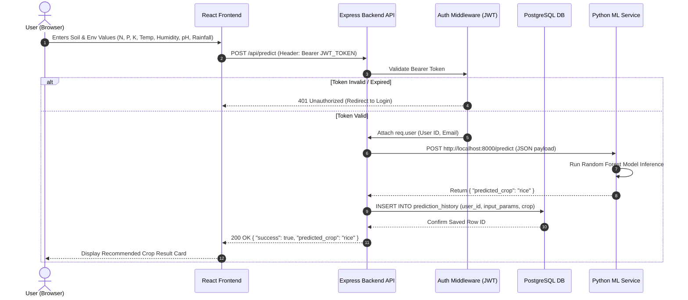
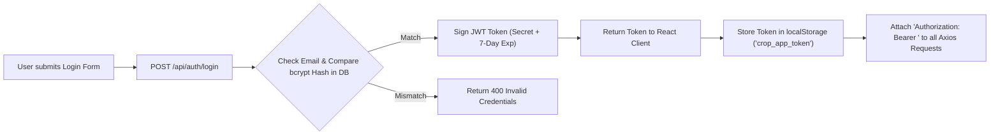

# System Architecture & Data Flow Diagram

This document presents the complete system architecture and end-to-end data flow for the **AI-Based Crop Recommendation System**.

## 📊 Current Implementation Block Diagram


---

## 🏗️ High-Level System Architecture

```mermaid
graph TB
    subgraph Client ["Client Presentation Layer (React + Vite)"]
        UI["React SPA Dashboard"]
        AuthCtx["AuthContext (JWT Session)"]
        Form["Prediction Form & History"]
        ProfileModal["User Profile Modal"]
    end

    subgraph Backend ["Backend API & Application Layer (Node.js & Express)"]
        Server["Express HTTP Server (Port 5000)"]
        AuthMW["JWT Auth Middleware (protect)"]
        AuthCtrl["Auth Controller (/api/auth)"]
        PredCtrl["Prediction Controller (/api/predict)"]
        HistCtrl["History Controller (/api/history)"]
    end

    subgraph ML ["Machine Learning Service Layer (Python Flask)"]
        MLApp["Flask Service (Port 8000)"]
        RFModel["Random Forest Classifier (scikit-learn)"]
    end

    subgraph DB ["Database Persistence Layer (PostgreSQL)"]
        UsersTbl[("users Table")]
        HistTbl[("prediction_history Table")]
        SensorTbl[("sensor_readings Table (Future IoT)")]
    end

    subgraph IoT ["Optional Hardware Layer (Raspberry Pi Zero 2 W)"]
        PiZero["Raspberry Pi Zero 2 W"]
        Sensors["NPK, Temp, Humidity, pH Sensors"]
    end

    %% Interactions
    UI -->|HTTP Requests / Bearer Token| Server
    Server --> AuthMW
    AuthMW --> AuthCtrl
    AuthMW --> PredCtrl
    AuthMW --> HistCtrl

    AuthCtrl <-->|User Credentials & Hashes| UsersTbl
    HistCtrl <-->|Query & Store History| HistTbl

    PredCtrl -->|POST /predict Payload| MLApp
    MLApp --> RFModel
    RFModel -->|Predicted Crop Label| PredCtrl
    PredCtrl -->|Store Input & Result| HistTbl

    Sensors --> PiZero
    PiZero -.->|POST /api/sensors/data (Future)| Server
    Server -.-> SensorTbl
```

---

## 🔄 End-to-End Prediction Sequence Diagram



---

## 🔐 Authentication & Session Flow



---

## 📦 Component Summary

| Component | Technology | Purpose |
| :--- | :--- | :--- |
| **Frontend** | React, Vite, Lucide-React, Axios | Interactive Dashboard, Login/Register screen, User Profile Modal, Prediction UI |
| **Backend API** | Node.js, Express.js | API routing, JWT verification, PostgreSQL query management, proxying to ML service |
| **ML Engine** | Python, Flask, Scikit-learn | Loads trained Random Forest model and performs crop prediction inference |
| **Database** | PostgreSQL | Persistent relational storage for user accounts and historical crop predictions |
| **Hardware (Future)** | Raspberry Pi Zero 2 W | Reads physical soil & weather telemetry and posts data to Express server |
